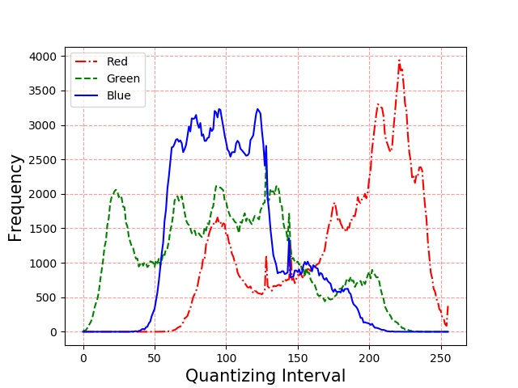
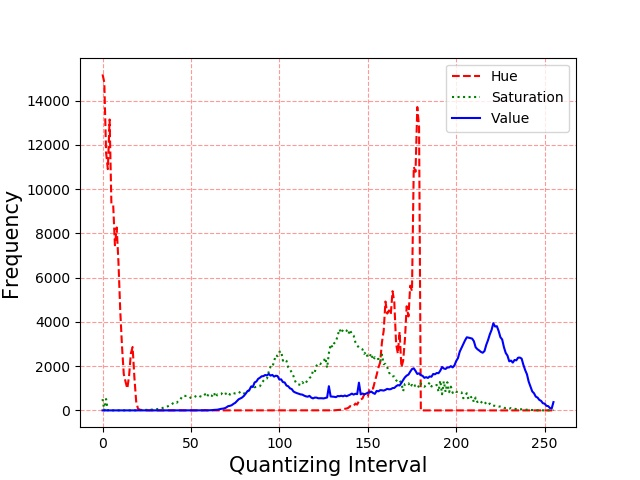
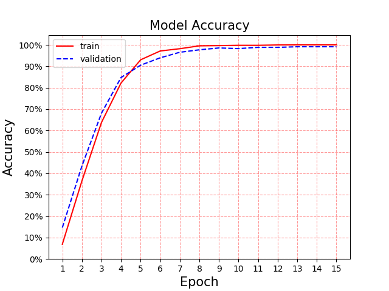
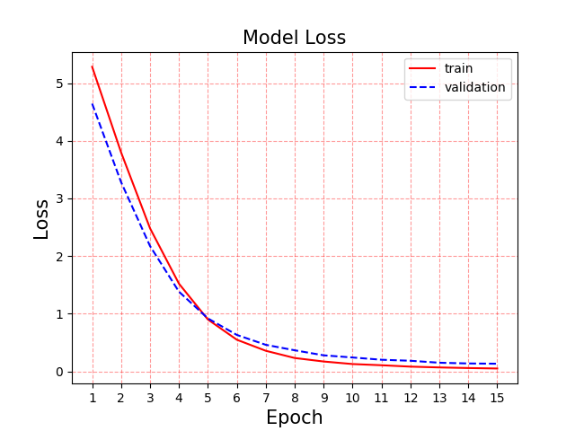
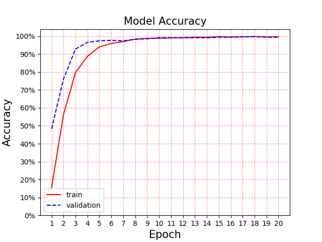
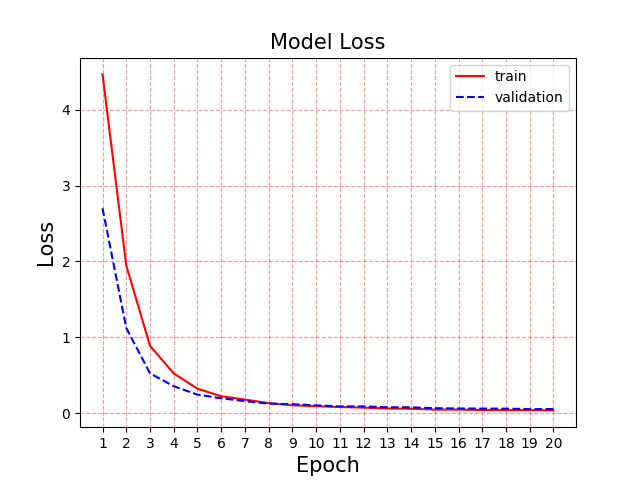
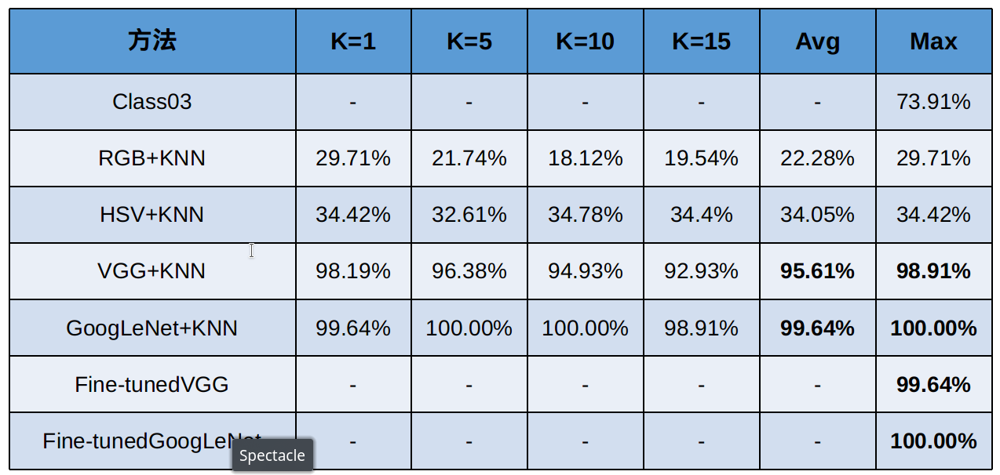

# PatternRecognition
燕山大学研究生模式识别课程作业(人脸图像分类)
# 模式识别作业说明
- 对“待分类”中的每一个图像，根据模式识别算法判断它与“已知类别”中哪一个图像最相似。
- 如果最相似的图像与它的文件名前四个字符相同，则说明识别正确，否则是识别错误。
- 计算出识别率：“待分类”中识别正确的图像个数 除以 “待分类”中的图像总数。
# 作业完成情况
共实现了六种方法,其中了两种方法是基于图像像素统计信息(视觉特征)和KNN实现,两种方法基于深度学习模型和KNN实现还有两种使用深度学习模型迁移实现,分别介绍如下:
## 1. [视觉特征+KNN](https://blog.csdn.net/wsp_1138886114/article/details/80660014#RGBHSVLab_41)
- RGB:统计图像在RGB颜色空间下的直方图,根据颜色直方图相似度确定图像之间的相似度,最后使用KNN方法进行图像类别预测.下面以下图为例进行说明. 
 
其RGB像素点信息统计结果为: 
 
- HSV:将图像从RGB颜色空间转化成HSV,将数字化图像特征提取出来,然后使用直方图方法进行统计,使用直方图相似度确定图像之间的i相似度,最后使用KNN进行图像的类别预测. 
 
其HSV像素点信息统计结果为: 
 
## 2. 深度学习模型+KNN
- GoogLeNet:使用[GoogLeNet](https://blog.csdn.net/qq_38906523/article/details/80061075)模型提取图像的特征向量,将最后一个最大池化层输出作为图像的特征向量,然后使用欧式距离计算各个图像之间的相似度,最后使用KNN进行图像类别的预测.
- VGG:使用[VGG](https://www.jianshu.com/p/1b37890989a9)模型提取图像的特征向量,将最后一个全连接层输出作为图像的特征向量,然后使用欧式距离计算各个图像之间的相似度,最后使用KNN进行图像类别的预测.

## 3. 深度学习模型迁移
- Fine-tunedGoogLent:去除了原有的分类器,加上两层全连接层进行分类,训练中只对新加的全连接层进行训练.
    - 训练结果 
     
     
- Fine-tunedVGG:去除了原有的分类器,加上了两层全连接层进行分类,训练中只对新加的全连接层进行训练.(代码中也是直接使用了提取的特征.)
     - 训练结果 
     
     
## 实验结果
 

## 实验环境
- OS: x86_64 Linux 5.3.11-1-MANJARO
- Python 3.7.4
- opencv-python  4.1.1.26
- scipy 1.3.2 
- Keras 2.3.1  
- tensorflow 2.0.0
